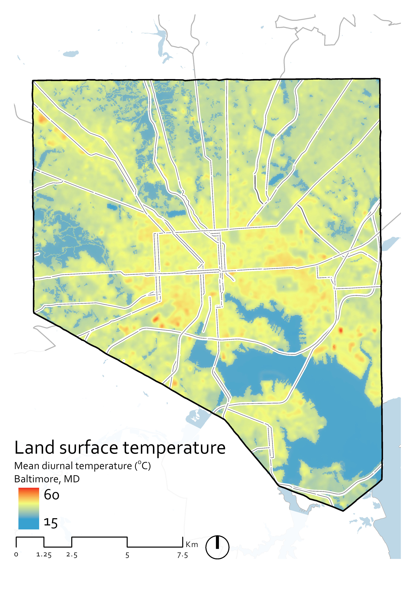

# Land Surface Temperature
Tom M Logan  
www.tomlogan.co.nz

## Description:
Understanding the factors influencing urban land surface temperature during the night and day.

## Cities analysed:
* [x] Baltimore (bal)
* [ ] Chicago (chi)
* [ ] Detroit (det)
* [ ] Phoenix (phx)
* [ ] Portland (por)

I'd like to add three cities from non-industrialized countries to see if the results are generalizable?
* [ ] Accra, Ghana (acr) - I'm not sure if the sat images are clear enough
* [ ] Kolkata, India (kol)
* [ ] Manila, Philippines (man)
* [ ] Nairobi, Kenya (nai) - AS has a paper on nai already, so data must be available

## Steps:
1. Process the LandSat images to land surface temperatures
2. Statistical analysis

## 1. LandSat images to LST, albedo, and NDVI:

#### 1.1 Download the satellite images
I selected the most recent four/five images per city and day/night where there was no cloud cover over the city of interest.

  1. Website: https://earthexplorer.usgs.gov/
  2. Enter Search Criteria:
      1. Address/Place - type the city name and state, e.g. 'Baltimore, MD' - click on the correct address and it should appear on the map.
      2. Date Range - we want to use summer dates
        I'm looking at years 2013-2017 and use months of May (05) - September (09) inclusive
        Need to find images that don't have too much cloud cover.
  3. Data Sets
      1. Select Landsat -> Landsat Collection 1 Level-1 -> Landsat 8 OLI/TIRS C1 Level-1
  4. Additional Criteria
      1. Sensor Identifier: OLI_TIRS
      2. Data type level-1: All
      3. Day/Night Indicator: Select relevant
      4. Cloud Cover: I leave these blank because I care about the cloud cover of the city, rather than the image and it's possible to have an image with high cloud cover but a clear sky above the city.
  5. View each image in turn and select ones with low cloud cover of the city

      When an image is selected
      * downloaded the Level-1 GeoTIFF Data Product
      * added to the `data/raw/<city>` directory
  6. Land Cover (NLCD) data for 2011 was downloaded using https://viewer.nationalmap.gov and the state the city is in was downloaded.
  7. Impervious surface and tree canopy was downloaded from https://viewer.nationalmap.gov as well.
  8. The shapefile of the city was downloaded from [catalog.data.gov](https://catalog.data.gov/dataset?collection_package_id=89f89c6f-741c-4121-98e3-d3f1f528ff53) dataset of city boundaries

#### 1.2 Metadata
  `data_source_satellite.csv` in `/data` provides information from each of the raw satellite images necessary for them to be processed. <br>
  `data_source_city.csv` in `/data` records the location of city specific data such as the land cover and tree canopy
  1. As data is downloaded, add it to the csv
  2. The maximum daily temperature (in Celsius) for the day needs to be retrieved from https://www.wunderground.com/history/?MR=1

#### 1.3 Process satellite images to LST, albedo, NDVI
This generally follows the process described in [Sahana, M., Ahmed, R., & Sajjad, H. (2016). Analyzing land surface temperature distribution ... *Modeling Earth Systems and Environment.*](https://www.researchgate.net/publication/301797360_Analyzing_land_surface_temperature_distribution_in_response_to_land_useland_cover_change_using_split_window_algorithm_and_spectral_radiance_model_in_Sundarban_Biosphere_Reserve_India)
  1. The code `L8_processing.py` takes the raw satellite images and land cover images and calculates the surface temperature, albedo, and ndvi.
  2. In doing so, `L8_processing.py` calls the function `clip_geographic_data.R` which is an R function that takes the raw images and clips them to the city size. The output of this is satellite and land cover images which are the clipped to the city limit (with 2km buffer). These are saved in `data/intermediate/<city>`.

      I may need to come back to [this link](https://gis.stackexchange.com/questions/103166/simplest-way-to-limit-the-memory-that-the-raster-package-uses-in-r) if I run into further raster memory issues during projection.
  3. The final images are saved in `data/processed/image/<city>`

#### 1.4 Calculate mean LST, albedo, NDVI
  This is done within `L8_processing.py`

  This is a plot of the mean LST for Baltimore
    {:width="50%"}


#### 1.5 Grid data for analysis
  1. df


## 2. Statistical inference on the dataset:

TBD

## Markdown Cheatsheet
*markdown cheat sheet: https://github.com/adam-p/markdown-here/wiki/Markdown-Cheatsheet*

#### Temporary example markdown:

    An indent will write in code

1. Lists

    Note: use tabs to indent new writing

3. Write code chunks

    Here is some Python code:

    ```python
    >>> print("Hello world!")
    Hello world!
    ```

    ```R
    >>> for (i in x){
    Hello world!
        }
    ```

4. Install ipymd:

    To install the latest release version:

    ```shell
    pip install ipymd
    ```

    Alternatively, to install the development version:

    ```shell
    pip install git+https://github.com/rossant/ipymd
    ```

6. Images

    Add an image like this

    

7. Checkboxes
    * [ ] Checkboxes are available for issues or steps
    * [x] You can click it in the markdown preview

5. Tables

    Table 1: example table

| Tables        | Are           | Cool  |
| ------------- |:-------------:| -----:|
| col 3 is      | right-aligned | $1600 |
| col 2 is      | centered      |   $12 |
| zebra stripes | are neat      |    $1 |
